# django-password-generator
Documentación Básica Django  
PREPARACIÓN PROYECTO PASSGENERATOR

INSTALACIÓN DE LIBRERÍAS
========================

-   **pip install virtualenv -\> instalación de virtualenv**

-   **pip install django -\> instalación de django**

===========================================================================

COMANDOS ENTORNO
================

-   **python \| python3 -m venv "x"**

-   **. ./x/bin/activate -\> De esta manera entramos al entorno desde linux/wsl**

- **. .\\x\\Scripts\\Activate.ps1 -\> Así desde windows**

COMANDOS DJANGO
===============

-   **django-admin startproject "x" -\>** Creamos proyecto con "x" como nombre

-   **python3 manage.py startapp "nombreapp" -\>** Creamos app con "x" como nombre

-   **python3 manage.py runserver -\>** Lanzar el servidor

-   **python manage.py makemigrations -\>** Realizamos migraciones después de hacer cambios en models.py

-   **python manage.py migrate -\>** Confirmamos esas migraciones

-   **python manage.py createsuperuser -\>** Creamos un superusuario para poder acceder a admin

LECCIÓN 1 \> CREACIÓN DE PRIMERA PÁGINA

PRIMERA PÁGINA EN DJANGO
========================

**Descarga de virtualenv-\> pip install virtualenv**

**Creación de entorno -\> python3 -m venv entornoclase**

**Entrar en el entorno -\> . ./entornoclase/bin/activate**

**Instalación de django -\> pip install django**

**Creación de proyecto -\> django-admin startproject generatePass**

**Creación de app -\> python3 manage.py startapp generador**

**Despliegue de servidor -\> python3 manage.py runserver**

**Después de añadir eso en views.py, y urls.py de vuestro proyecto,
lanzais el servidor y veréis vuestra página**

LECCIÓN 2 \> CREACIÓN DE VARIAS PÁGINAS

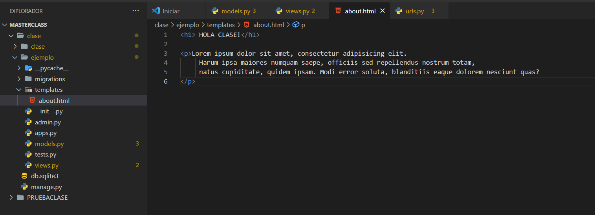

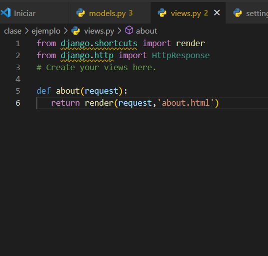
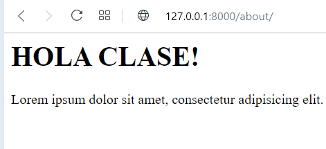
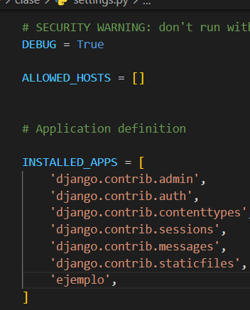

LECCIÓN 3 \> GENERADOR DE CONTRASEÑAS

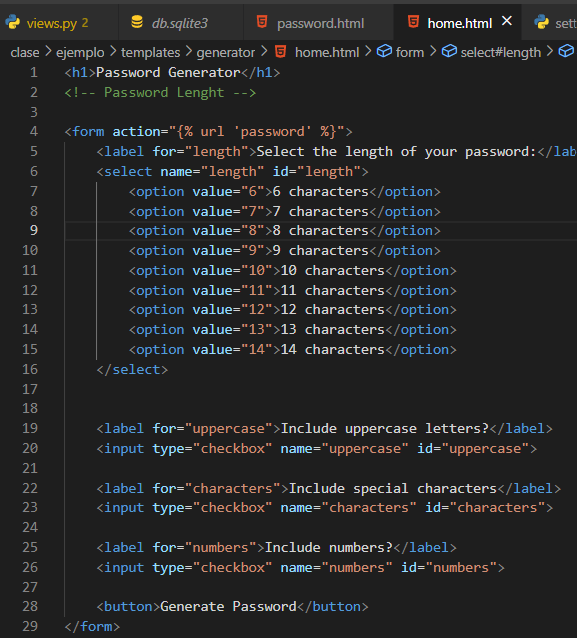
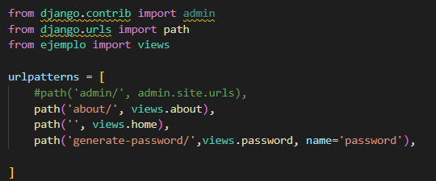
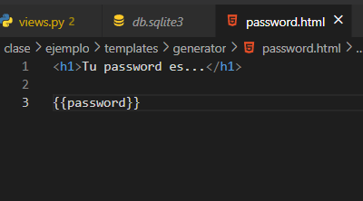
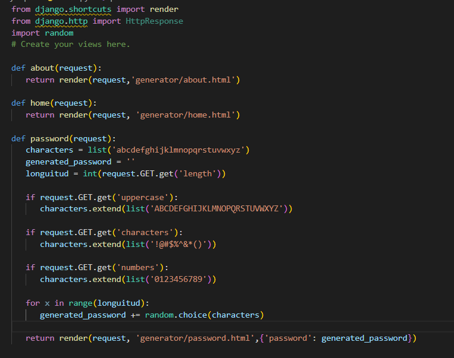

LECCIÓN 4 \> BASE DE
DATOS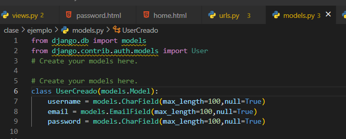

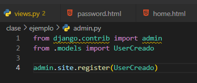

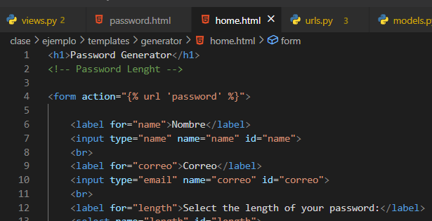

**python manage.py makemigrations**

**python manage.py migrate**

**python manage.py createsuperuser**

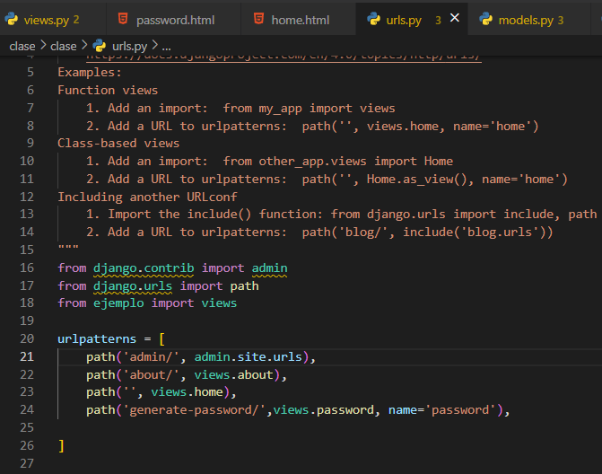

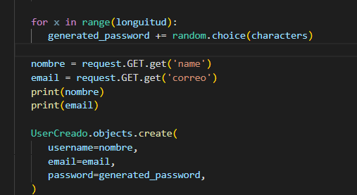

